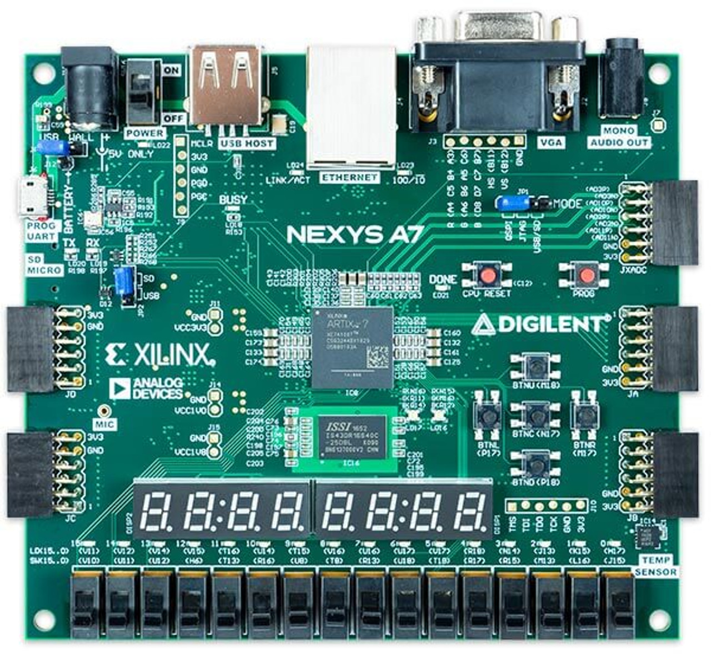
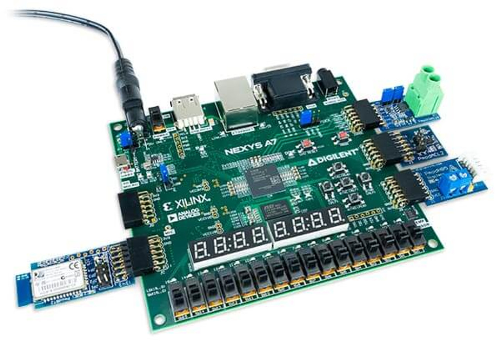

# **FPGA Projects**
This highlights a collection of my projects I developed using Verilog HDL and implemented on a Nexys A7 100t FPGA board demonstrating a range of functionalities and design techniques.

